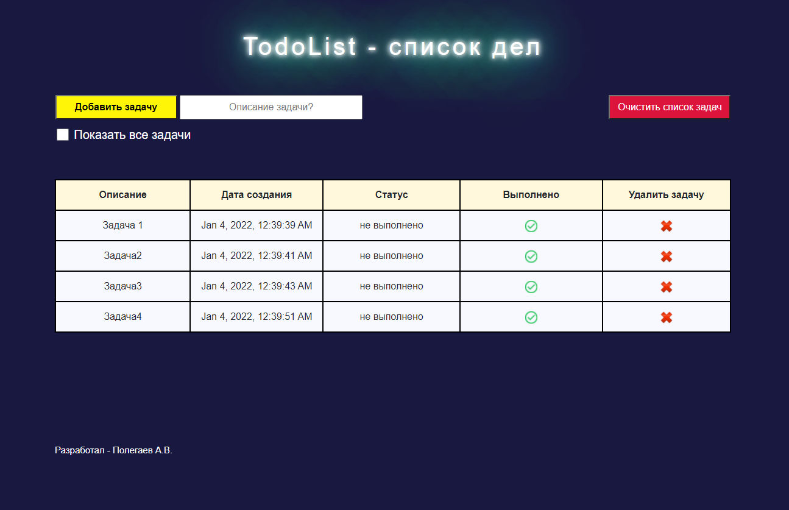
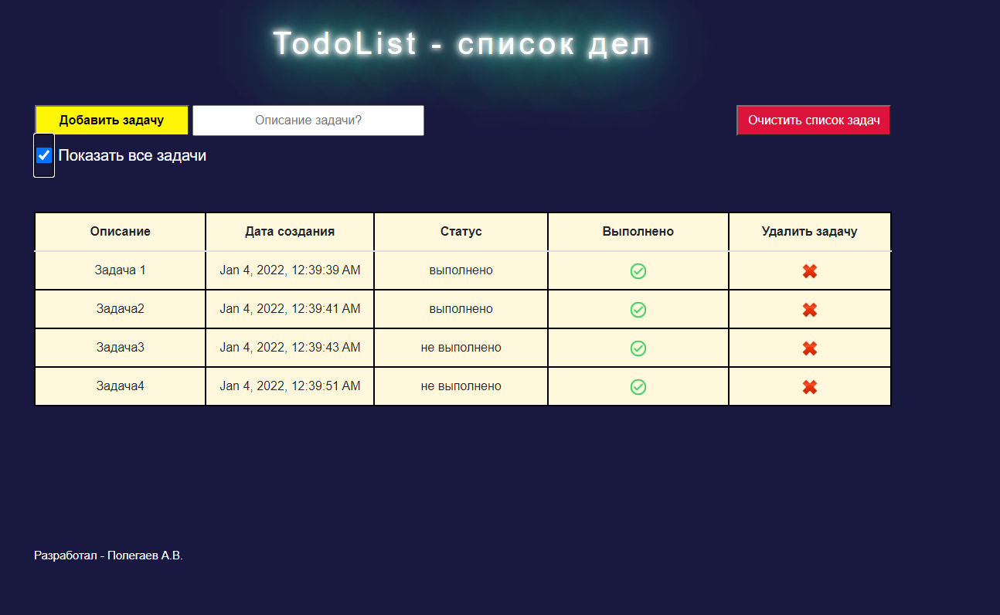

# TodoList project

TodoList.

What was used: 
Java 14, Hibernate, Lombok, AJAX, Bootstrap, HTML, CSS

This application provides the following service: add task, delete task, delete all tasks, we can mark it 
as completed, show all tasks - completed and uncompleted. 

Contacts: 

+7 964 630 77 53 (also whatsapp)

Telegram: https://t.me/Andrey_Polegaev

