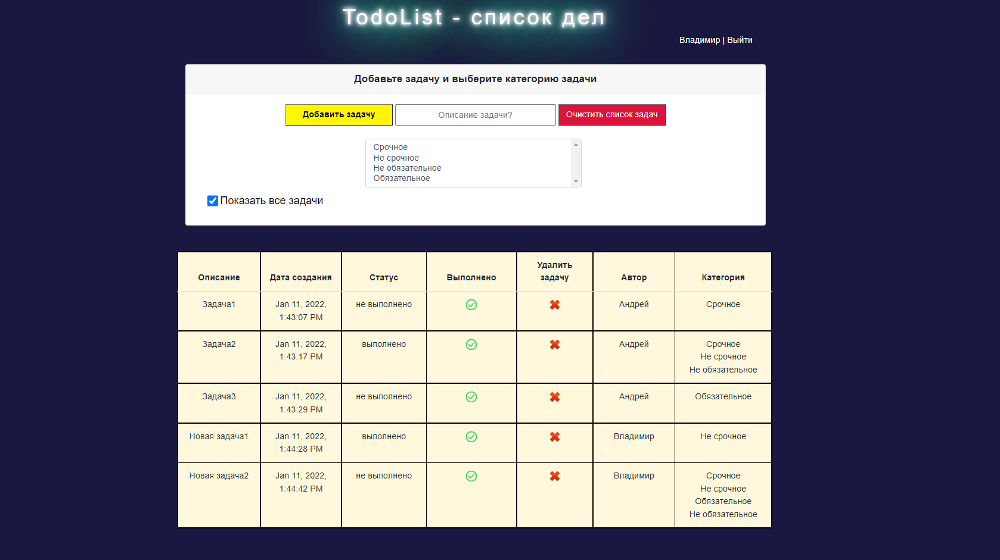
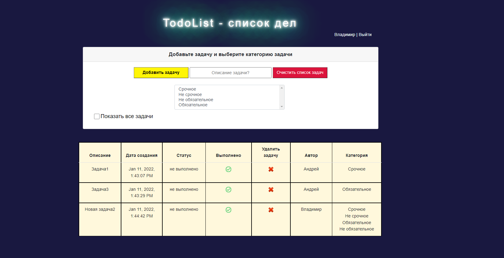
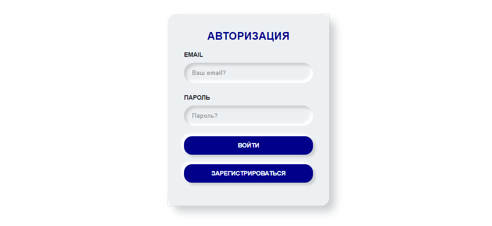
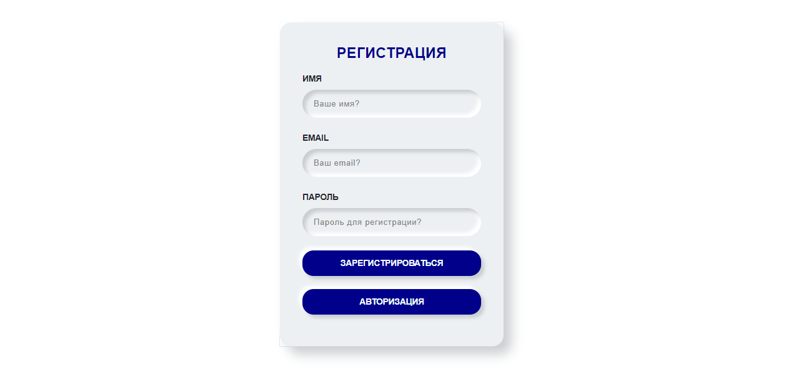
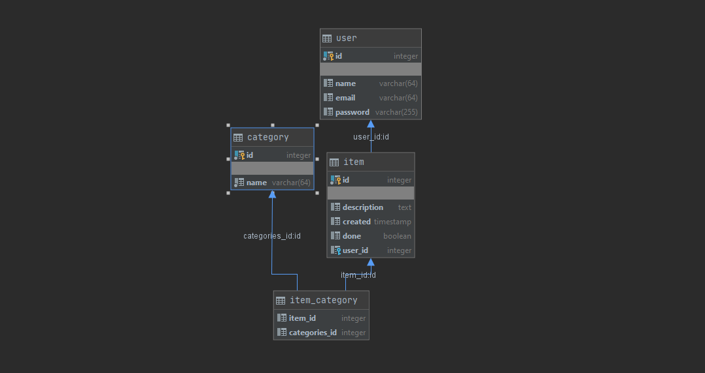
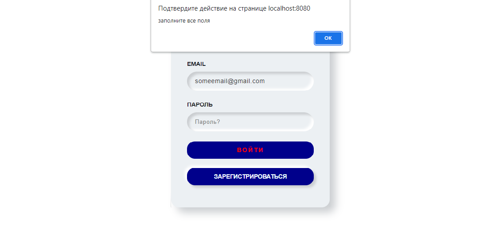

# TodoList project

TodoList.

What was used: 

Java 14, 
Java EE Servlets,
Hibernate,
PostgreSQL,
Apache Maven,
Apache Tomcat,
Json,
Log4j2,
Lombok,
AJAX,
Bootstrap,
HTML,
CSS,
jQuery,
Java Script,
Wrapper template data base.

This application provides the following service: add task, delete task, delete all tasks, we can mark it 
as completed, show all tasks - completed and uncompleted. 
Validating all the forms, registration - authorisation with checking user presents or absents in the data base.
Sheets have uni-directional connection. 
Each task connects with its own user and each task has own list of categories.

Contacts: 

+7 964 630 77 53 (also whatsapp)

Telegram: https://t.me/Andrey_Polegaev

